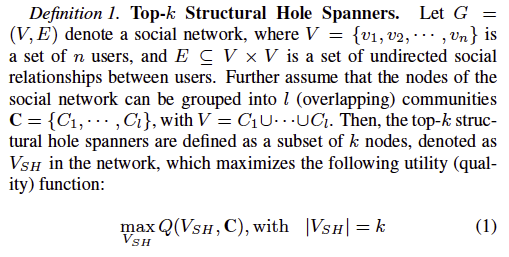
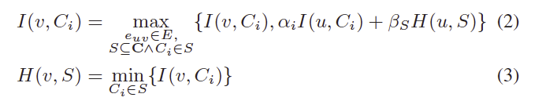
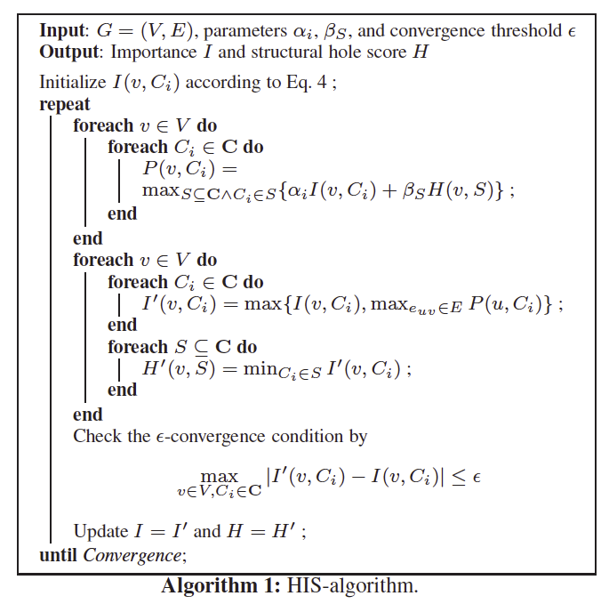
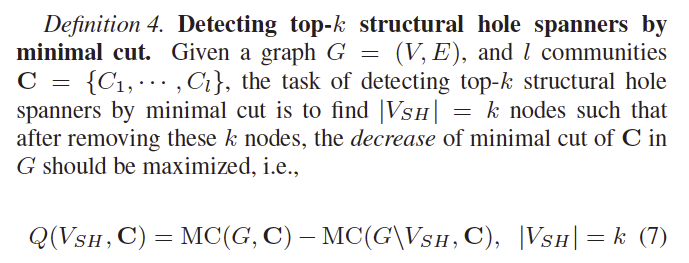
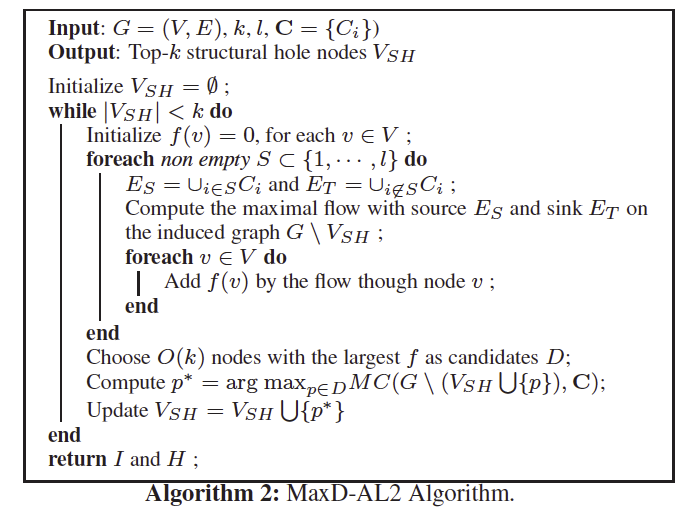

#**Structural Hole Spanners 发现算法HIS和Max-D**
We assume a setting in which a set V of n distinct users form l groups C = {C1, ..., Cl} (called communities). A utility function Q(v,C) is defined for each node to measure its degree to span structural holes.

##HIS算法
两个重要的公式：

其中$C_i$是图$G=(V,E)$的一个社区，$v$是一个节点，$e_{uv}$是节点u和v的一条边，S代表的是所有社区的一个子集，$I(v,C_i)$表示的是节点v在社区$C_i$的重要程度。$H(v, S)$表示的是节点v在子集S中跨越社区的程度。
具体算法如下：

##Max-D算法
The second model is based on the idea that users who span structural holes play an important role in information diffusion between different communities. Following this, we formalize the problem of structural hole spanner detection by `minimal cut`. Given this, the structural hole spanner detection problem can be cast as finding top-k nodes such that `after removing these nodes, the minimal cut in G will be significantly reduced`, i.e., the decrease of the minimal cut after removing will be maximized. The idea is natural, as structural hole spanners play bridging roles between communities. Without these structural hole nodes, the connections between different communities would be minimized.

where MC(G, C) denotes the minimal cut to separate all communities C in social netowrk G.
具体算法如下：

 ---
  翻译总结：当top-k的结构洞跨越者被移除时，图G的最小切割将会显著的减少。
 
   
##参考
http://cn.aminer.org/structural-hole
 the paper is [here](http://keg.cs.tsinghua.edu.cn/jietang/publications/WWW13-Lou&Tang-Structural-Hole-Information-Diffusion.pdf)
